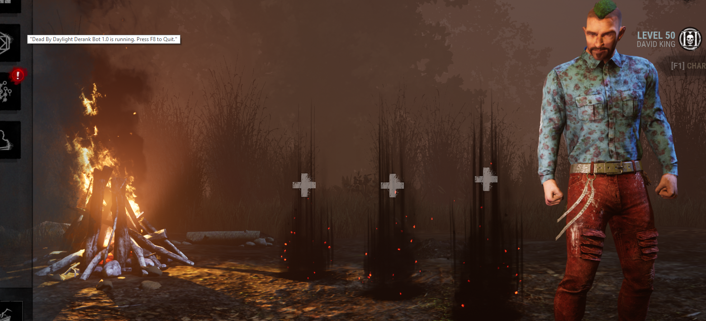

# DRank

DRank is a set of AutoHotkey scripts to automate queueing in & out of DBD games as a survivor. 

> Warning: This is only a proof of concept, please do not actually use.

## Requirements:
* Windows
* System Resolution **_must_ be 1920x1080** (needs fixing)

## Installing:
* First you'll need to click here to [Download and Install](https://www.autohotkey.com/download/ahk-install.exe) AutoHotKey. 
* Next you'll need to download DRank by clicking [here](https://github.com/tawksik/DRank/archive/master.zip)
*  Unzip the archive and double click DRank.ahk

## Usage:

#### Start / Stop Key: `F8`

After the script is running in AHK you'll want to log into DeadByDaylight and log into the survivor queue. Then you'll want to choose the survivor you want the bot to play as and press `F8`.

You should be met with a tooltip like so:

After you see that you're all done, just kick back and relax. A few seconds will pass by and then the "READY" button will be clicked

### Questions:

> Does this work with multiple monitors?

This has not been tested on systems with multiple monitors, at the moment i'd assume not

> Can i minimize the window?

You can minimize the window, however the auto-queue mechanism will not continue until you switch back

> Can i play / interact with the game while DRank is on?

Yup, there should be no problem / weird keys being pressed whatsoever while you're in the game. in the event there is you can always press `F8` and the script will pick up from where you left off when you're ready for it to take control again

> Can i get banned for this / is this detectable?

Technically yes, Realistically no. This script doesn't attempt to play for you at all and simulates user movement, it simply presses the "READY" and "CONTINUE" buttons when they appear. You'd sooner get banned for being reported as AFK if you just left this running for days on end.

> Does this work for clients other than English?

No. Though it should be possible to add it